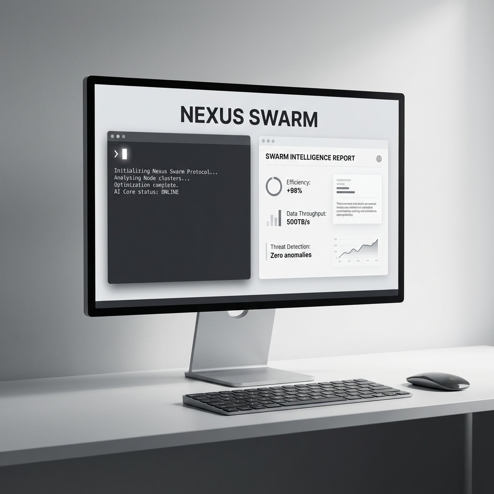
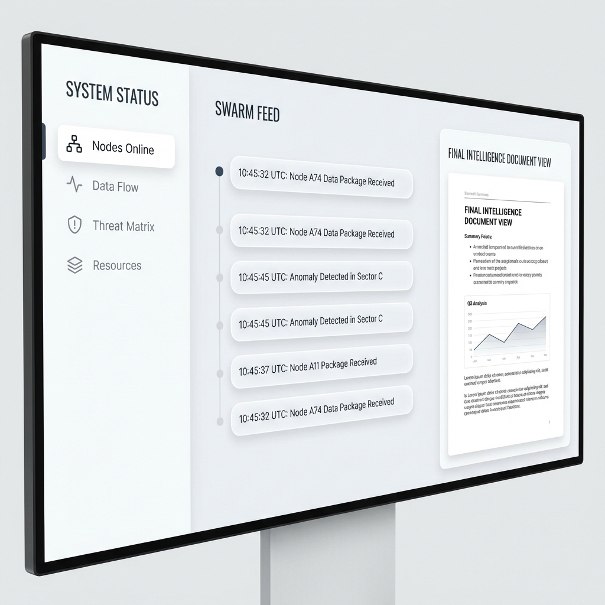

# Nexus Swarm (AG-01)
### Stateful Multi-Agent Orchestration & Research Engine




## 🌌 Overview

**Nexus Swarm** is the flagship agentic system for the 2026 Gen AI Series. It is a sophisticated **Stateful Multi-Agent system** built on **LangGraph**, designed to solve complex, multi-step research and synthesis problems. 

Unlike standard linear LLM chains, Nexus Swarm operates as a **Cyclical State Machine** with a dedicated "Human-in-the-Loop" (HITL) authorization layer, ensuring precision and reliability in long-running AI workflows.

---

## 🏗️ Cognitive Hub (Architecture)


Nexus Swarm utilizes a **Manager-Worker Pattern**:

1.  **Orchestration Layer (Manager)**: Analyzes user objectives and routes tasks dynamically based on the current state and confidence scores.
2.  **Intelligence Layer (Researcher)**: Accesses real-time web data via DuckDuckGo and specialized tools to gather the latest technical information.
3.  **Synthesis Layer (Writer)**: Compiles raw intelligence into high-fidelity documents, code, or technical reports.
4.  **Audit Layer (Reviewer)**: Performs an automated quality audit, providing feedback to the Writer or Researcher for iterative improvement.

---

## 🎨 Professional Interface



The project features a **Modern Premium Dashboard** built with **Next.js 14**, **Tailwind CSS**, and **Framer Motion**.
- **Neural Telemetry Feed**: Real-time logs showing the thought process of each agent.
- **Glassmorphism Design**: High-end aesthetic with dark/light mode optimization (Portfolio V3 Standard).
- **Interactive State Control**: Pause and resume the swarm during the "Research Cache" approval phase.

---

## 🔥 Senior Signals (Technical Highlights)

- **State Persistence**: Uses LangGraph's checkpointer (Memory/PostgreSQL) to allow mission recovery and session-based logic.
- **Human-in-the-Loop (HITL)**: Implements `interrupt_before` breakpoints for rigorous data validation before report generation.
- **FastAPI Backend**: A high-performance REST API bridging the Python LangGraph engine with the React Frontend.
- **Type-Safe Cognitive State**: strictly defined data contracts using **Pydantic V2**.

---

## ⚙️ Workflow Infographic


---

## 🚀 Quick Start

### 1. Engine Setup (FastAPI Backend)
```bash
cd nexus-swarm
pip install -r requirements.txt
python -m backend.api.endpoints
```

### 2. Terminal Console (Next.js Frontend)
```bash
cd web
npm install
npm run dev
```

---

## 👤 Author

**Harshan Aiyappa**  
Senior Full-Stack Hybrid AI Engineer  
Voice AI • Distributed Systems • Infrastructure

[](https://kimo-nexus.vercel.app/)
[](https://github.com/Kimosabey)
[](https://linkedin.com/in/harshan-aiyappa)
