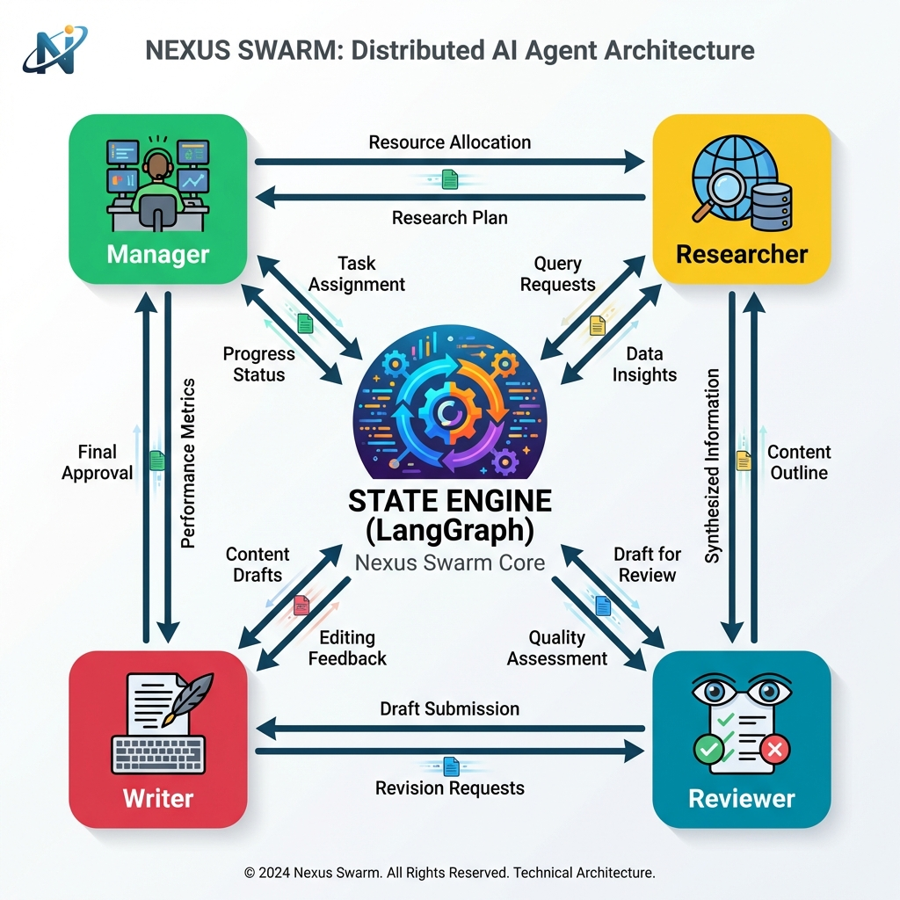
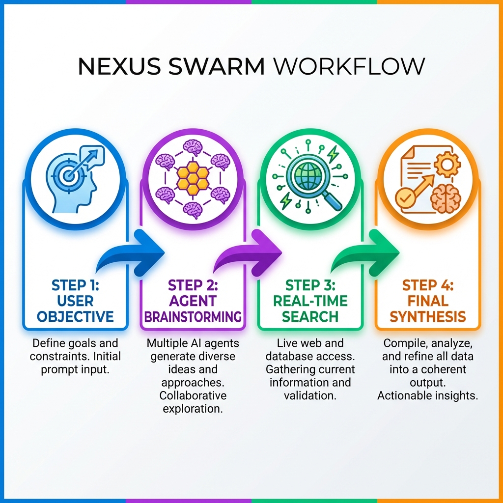

# Architecture: Nexus Swarm

## High-Level Design (HLD)

Nexus Swarm is built on a **directed cyclical graph** (DCG) where nodes are autonomous agents and edges represent state transitions.

### Modern Technical Architecture


### The Core: LangGraph State Engine
The system logic is governed by a central `state` object that persists throughout the mission.

1.  **Node: Manager**: The entry point. Uses GPT-4o-mini to plan and route.
2.  **Node: Researcher**: A tool-enabled agent that performs web searches and context retrieval.
3.  **Node: Writer**: Synthesizes structured data into a markdown/text report.
4.  **Node: Reviewer**: Self-audit node that checks for factual accuracy and format.

---

## Low-Level Design (LLD)

### Data Flow & Persistence
We use a `MemorySaver` checkpointer to enable session suspension. This allows the system to pause at the **Researcher** node, wait for user input (via the Next.js UI), and then resume execution.

### Pydantic State Schema
```python
from typing import TypedDict, List

class AgentState(TypedDict):
    goal: str
    iterations: int
    research_notes: List[str]
    draft: str
    revision_notes: str
    next_agent: str
```

---

## Technical Stack Justification

| Technology | Reasoning |
| :--- | :--- |
| **LangGraph** | Provides fine-grained control over loops and state, which standard chains lack. |
| **FastAPI** | High-performance async support for streaming agent events to the UI. |
| **Next.js 14** | Best-in-class React framework for building responsive, premium AI dashboards. |
| **OpenAI GPT-4o** | Balances cost-effective reasoning (mini) with high-fidelity output (standard). |

---

## Workflow Visualization

